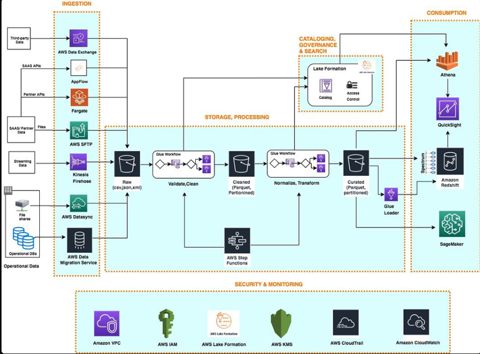

### QUESTIONS AND ANSWERS ON PART B

### How would you do this in a production cloud environment?

Deploying on production will involve having the details below and the architecture:

Cloud Services for Storage and Database:

1. Use a managed relational database service like Amazon RDS or Google Cloud SQL for storing the transformed data.
2. Use cloud object storage such as Amazon S3 or Google Cloud Storage for raw data storage (e.g., storing CSV files and JSON files).

Data Ingestion & ETL:
1. Use a serverless compute service like AWS Lambda or Google Cloud Functions to automate the data ingestion and processing. Airflow or Dagster can also be used.
2. Managed ETL services like AWS Glue or Azure Data Factory can be used to orchestrate data flows, transformations, and schedule tasks.

Containerization & Orchestration:

1. Deploy the services for the data pipeline using Terraform and the customized image on ECS/ECR.
2. Use Docker for packaging the data processing code and manage deployment through CI/CD pipelines with tools like Jenkins, GitLab CI, or GitHub Actions.

Pipeline Monitoring:

1. Implement data quality checks using dbt (Data Build Tool) or build custom checks with Apache Airflow.
2. Use logging and monitoring services like AWS CloudWatch, Grafana labs or Google Stackdriver for tracking the data pipeline's health.

Security Implementation:

1. Password credentials will be stored in AWS Secret manager or Vault instead of hardcoding or using .env files

### How would your solution change if the data inputs were to be received in the form of streamed messages?

If the data ingested is via real-time or near real time, then the architecture will change as depicted below:

Stream Processing Frameworks:
1. Use tools like Apache Kafka, AWS Kinesis, MSK, or Google Pub/Sub to receive and process real-time streaming data with AWS schema registry.
2. Implement Apache Flink or Apache Spark Streaming for near-real-time processing and transformations of the streaming data.

Data Transformation:

1. Adapt the feature engineering logic to work as a sliding window operation on streams.
2. Use windowing functions in Apache Beam (via Dataflow in Google Cloud) to compute rolling medians and other aggregate metrics in real-time.

Database Changes:

1. Use NoSQL databases like Cassandra or DynamoDB for high-throughput, low-latency reads and writes.
2. Consider using a time-series database like InfluxDB for efficiently storing and querying time-based metrics.

### How would your solution change if the data was 100x the scale?

Scalable Data Storage:

1. Switch to a distributed data warehouse like Snowflake, BigQuery, or Redshift for handling larger datasets.
2. Use partitioning and clustering strategies to optimize data retrieval and reduce query latency. 

Compute and Processing:

1. Use distributed computing frameworks like Apache Spark on Amazon EMR or Dataproc for scalable data transformations.
2. Implement horizontal scaling with autoscaling groups on cloud platforms to dynamically adjust compute resources.

Data Processing Optimization:

1. Use columnar storage formats like Parquet or ORC to optimize data storage and improve query performance.
2. Implement caching strategies using Redis or Memcached for frequently accessed data.

### What kind of architecture and approach would you use to serve this data for dashboards and reporting, used by multiple teams with differing requirements?

Data Warehousing for Centralized Analytics:

1. Store aggregated data in a cloud data warehouse like Snowflake or BigQuery with role-based access control to manage data access across teams.
2. Create materialized views or aggregate tables for different team requirements, improving query performance for dashboards.
3. Implement data mart and streamline access and requirement per team.

